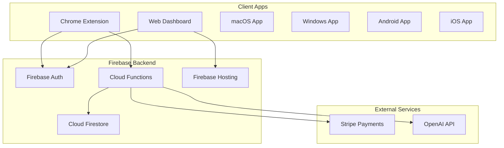

# ZAS Safeguard - System Overview

## Architecture Overview

---

## Data Flow

### Blocking Flow
1. Extension installed → generates unique `deviceId`
2. User logs in → token stored locally
3. Extension syncs blocklist from Firestore via Cloud Function
4. `declarativeNetRequest` rules block matching URLs
5. Blocked attempts logged to Firestore
6. Dashboard displays activity in real-time

### Unlock Flow (Owner Mode)
1. User requests unlock → 30-minute cooldown starts
2. After cooldown, user enters 60+ character master key
3. Key hashed and compared to stored hash
4. If match, temporary unlock granted
5. All attempts logged to `admin_logs`

---

## Firestore Schema

### Core Collections

| Collection | Purpose | Access |
|------------|---------|--------|
| `users/{userId}` | User profiles, settings, mode | Owner only |
| `devices/{deviceId}` | Registered devices | Owner + parent |
| `owner_profiles/{userId}` | Owner mode settings | Owner only |
| `family_profiles/{familyId}` | Family mode settings | Parent only |
| `children/{childId}` | Child profiles | Parent only |

### Blocking Collections

| Collection | Purpose | Access |
|------------|---------|--------|
| `blocklists/global` | Global blocklist | Read: all, Write: admin |
| `blocklists/core` | Permanent adult blocklist | Read: all, Write: NONE |
| `blocklists/custom/{userId}` | User custom blocklist | Owner only |
| `block_policies/{policyId}` | Category policies | Read: all, Write: admin |

### Activity Collections

| Collection | Purpose | Retention |
|------------|---------|-----------|
| `logs/{logId}` | Activity logs | 30 days |
| `studySessions/{sessionId}` | Study mode history | 1 year |
| `blocked_creators/{creatorId}` | Blocked creators | Permanent |
| `errorLogs/{userId}/entries` | Client errors | 7 days |
| `admin_logs/{userId}/events` | Security events | 90 days |
| `security_events/{userId}/{deviceId}` | Extension security events | 30 days |
| `alerts/{userId}` | Parent alerts | 90 days |
| `alert_settings/{userId}` | Alert thresholds | Permanent |
| `mail/{mailId}` | Email queue (Firebase Email Extension) | Auto-deleted |

### System Collections

| Collection | Purpose |
|------------|---------|
| `config/version` | Version management |
| `rate_limits/{userId}` | Rate limiting data |
| `subscriptions/{userId}` | Subscription status |
| `fraud_scores/{userId}` | Fraud detection |

---

## Cloud Functions

### Version Functions
- `getVersion` - Get current version info
- `checkVersion` - Check if client is outdated
- `incrementVersion` - Bump version (admin only)
- `versionCheck` - HTTP endpoint for version check

### Auth Functions
- `onUserCreate` - Initialize user on signup
- `verifyPhone` - Phone verification
- `initializeDevice` - Register new device

### Blocking Functions
- `getBlockPolicy` - Get user's block policy
- `syncBlocklist` - Sync blocklist to device
- `logBlockEvent` - Log blocked URL
- `updateCustomBlocklist` - Update user blocklist

### Alert Functions (Parent Notifications)
- `onSecurityEvent` - Firestore trigger for security events
- `checkHeartbeats` - Scheduled (every 5 min) heartbeat check
- `logSecurityEvent` - Log security event from extension
- `getAlerts` - Get user's alert history
- `updateAlertSettings` - Update alert thresholds
- `markAlertRead` - Mark alert as read

### Override Functions
- `requestUnlock` - Start unlock process
- `verifyUnlock` - Verify master key
- `syncUnlockStatus` - Sync unlock across devices
- `getUnlockStatus` - Check unlock status

### Cleanup Functions
- `cleanupOldLogs` - Daily scheduled cleanup
- `checkRateLimit` - Rate limit enforcement
- `logErrors` - Log client errors
- `archiveUserData` - Premium archive export

### Subscription Functions
- `createCheckoutSession` - Stripe checkout
- `stripeWebhook` - Handle Stripe events
- `checkTrialEligibility` - Verify trial eligibility
- `getRegionalPrice` - Get localized pricing

---

## Security Model

### Owner Mode (Ultra-Strict)
- ❌ Cannot disable extension
- ❌ Cannot remove adult blocklist
- ❌ Cannot downgrade to Family mode
- ✅ 30-min cooldown + 60-char master key for unlock
- ✅ All unlock attempts logged

### Family Mode
- ✅ Parent controls all settings
- ❌ Children cannot modify parent settings
- ❌ Cannot access owner profiles
- ✅ Activity monitoring enabled

### Security Rules Enforcement
- Device can ONLY modify its own document
- Child cannot modify parent settings
- No client writes to `core` blocklist
- Subscriptions managed by Cloud Functions only
- Rate limiting enforced (1 write/sec)

---

## Known Edge Cases

| Scenario | Behavior |
|----------|----------|
| No internet | Fallback blocklist active |
| Cache expired (24h) | Force refresh on next startup |
| Extension disabled | Re-enable attempt, log event |
| DevTools opened | Logged as tamper attempt |
| Clock manipulation | Server timestamps used |
| Incognito mode | Extension still active |

---

## Emergency Unlock Process

1. Navigate to Settings → Emergency Unlock
2. Enter master key (60+ characters)
3. 30-minute cooldown begins
4. After cooldown, enter key again
5. Verify → Temporary unlock (configurable duration)
6. All steps logged in `admin_logs`

---

## Version History

| Version | Date | Changes |
|---------|------|---------|
| 1.0.0 | Dec 2024 | Initial release |
